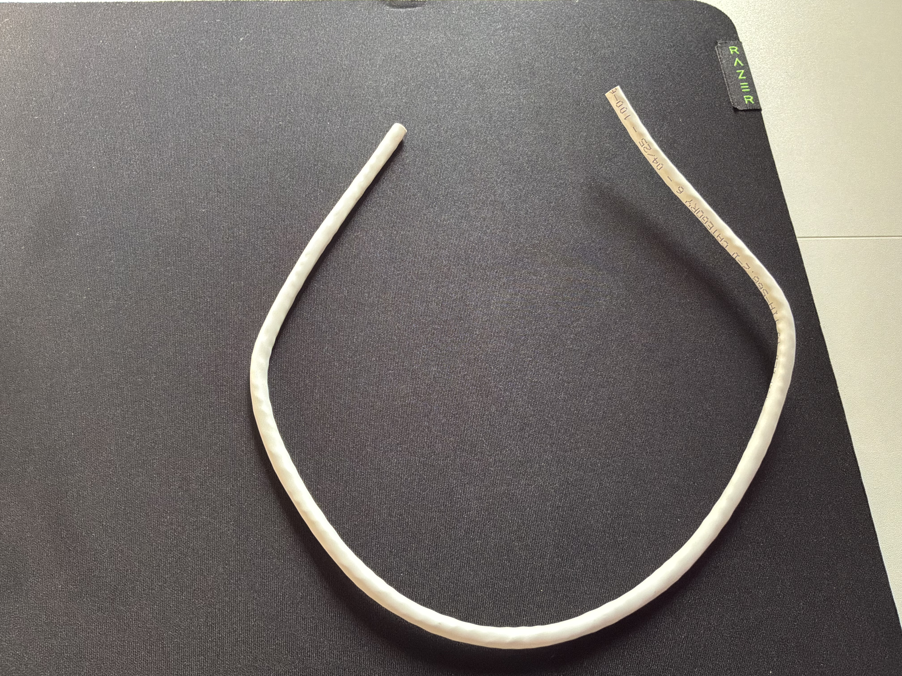
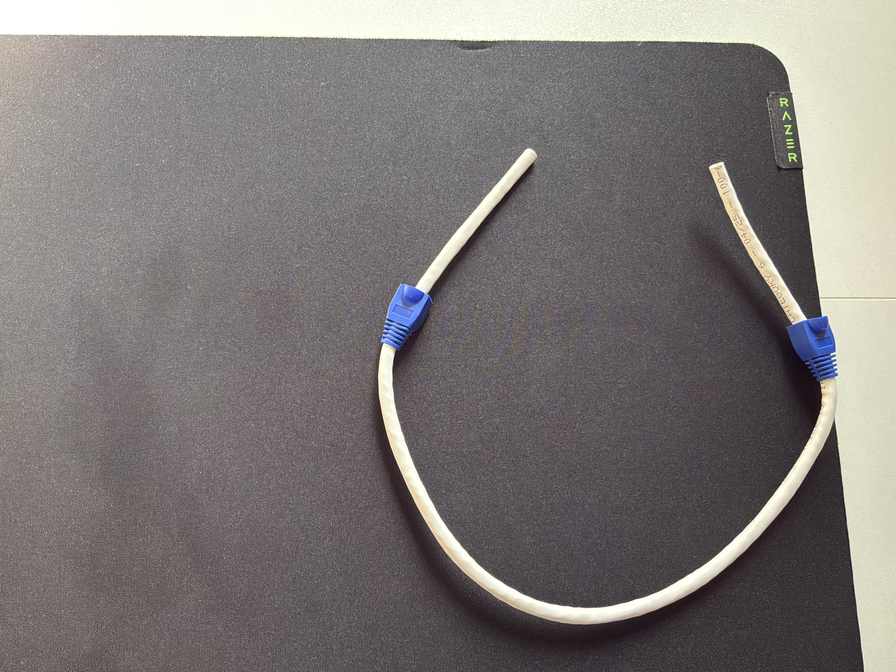
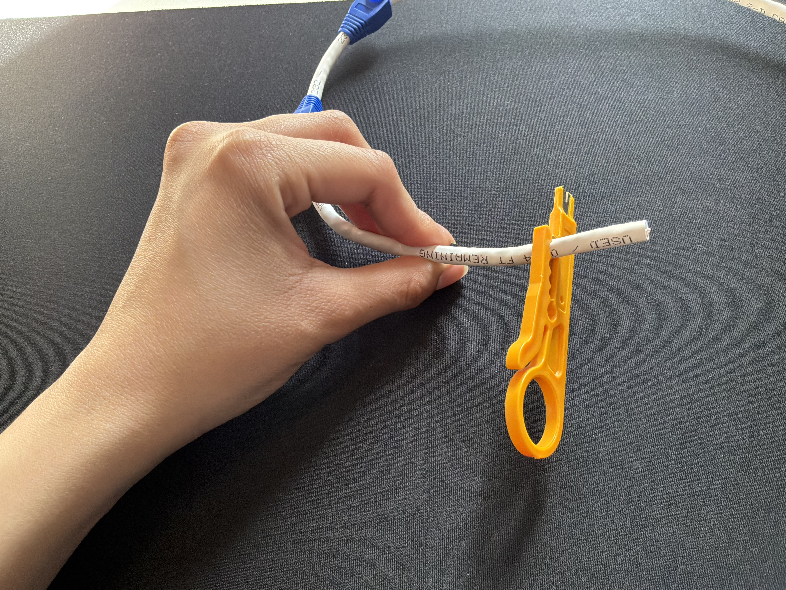
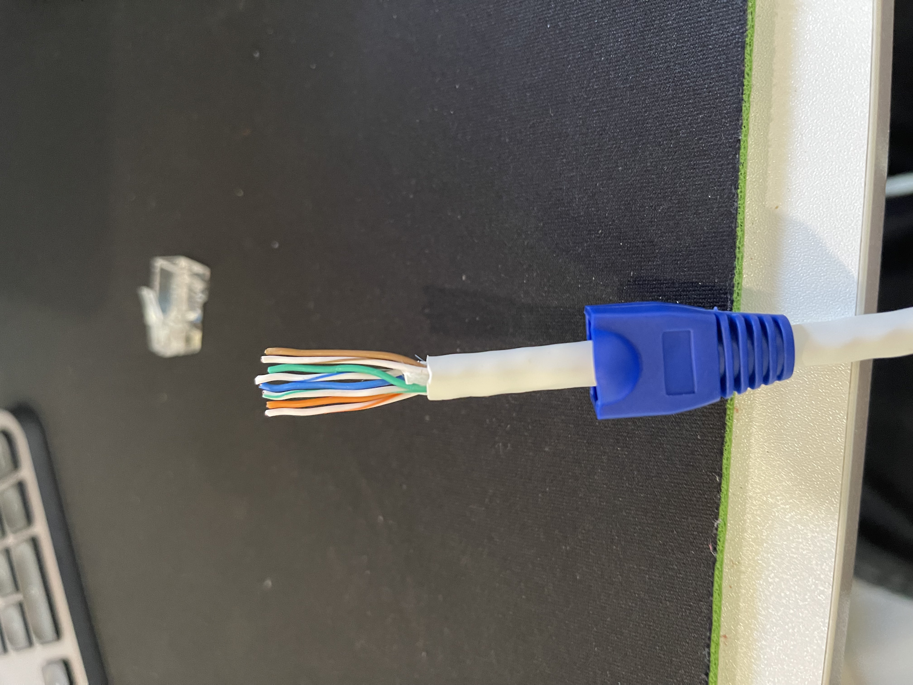
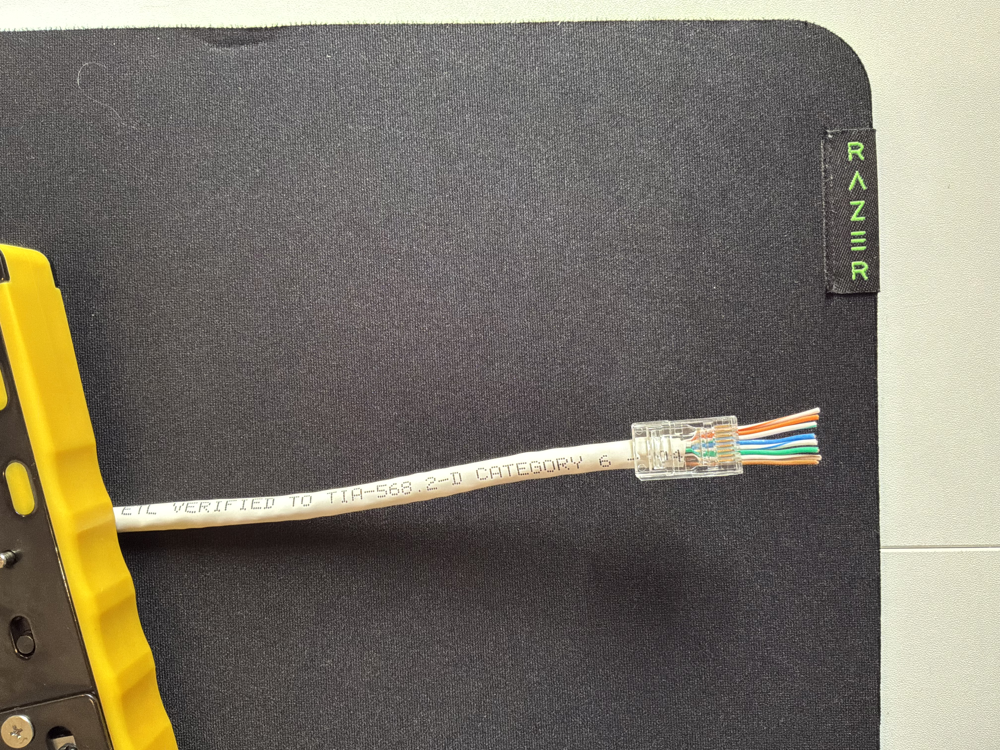
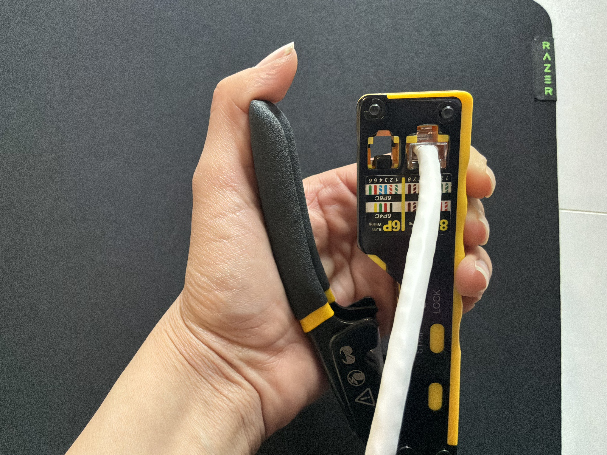
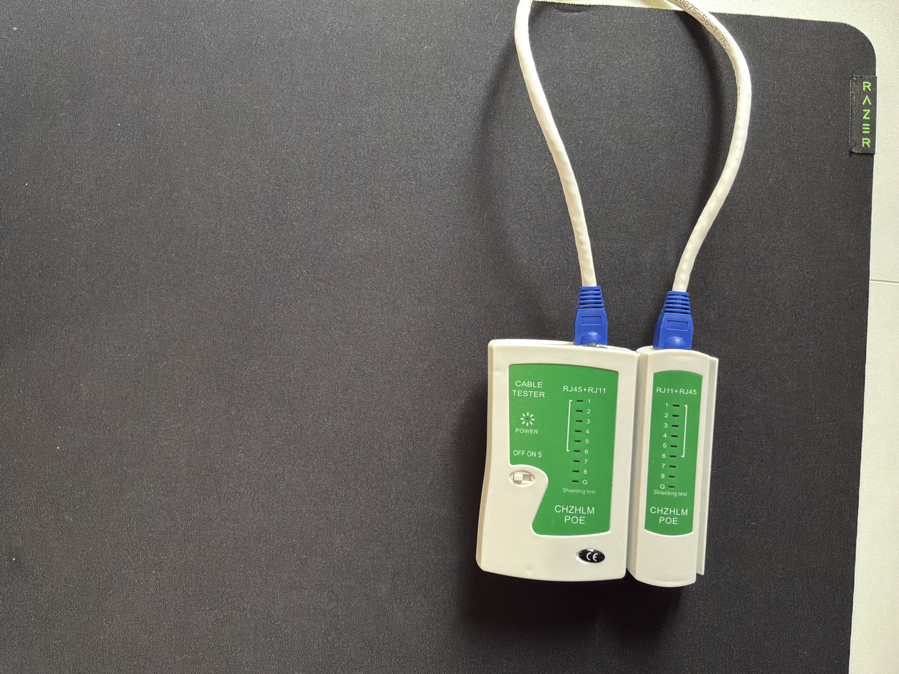
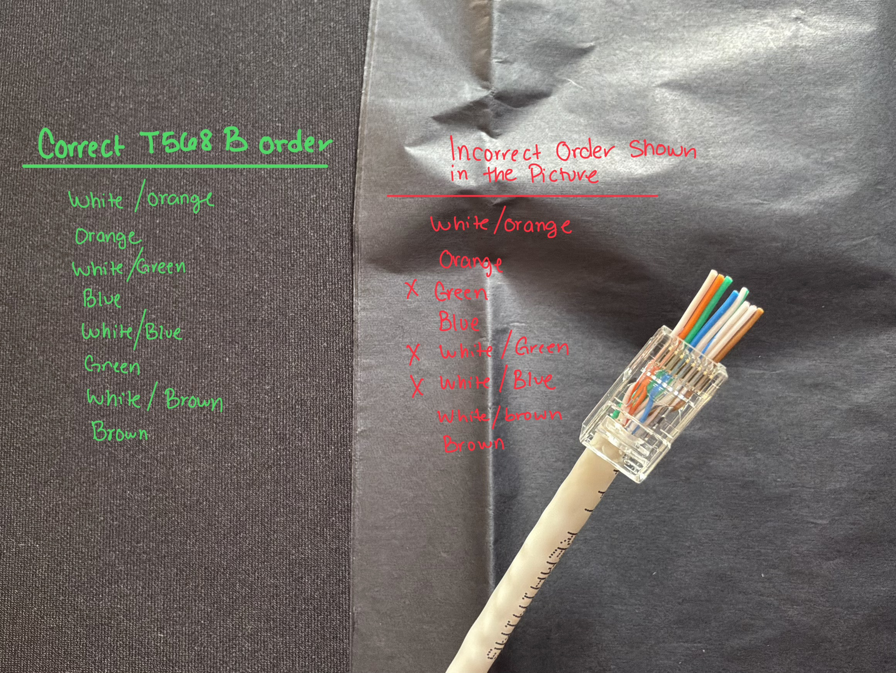

# Ethernet Cable Termination

## Overview
For this project, I practiced terminating Cat6 Ethernet cable with RJ45 connectors. The goal was to learn the proper process for preparing Ethernet cable, arranging the conductors according to the correct wiring standard, terminating the cable, and verifying that the finished cable worked correctly using a cable tester. 

I documented the process with photos and videos and successfully created working Ethernet cables.

## Equipment Used
  * Cat6 Ethernet cable
  * RJ45 pass-through connectors
  * RJ45 crimping tool
  * Ethernet cable tester
  * Cable stripper/cutter

## T568B Wiring Standard
For my straight-through Ethernet cable, I used the T568B wiring standard on both ends of the cable.

The T568B pin order is:
1. White/Orange
2. Orange
3. White/Green
4. Blue
5. White/Blue
6. Green
7. White/Brown
8. Brown

## Cable Termination Process

### 1. Preparing the Cable
I cut the Cat6 cable to the length needed for practice. Before beginning the termination, I slid an RJ45 strain-relief boot onto each end of the cable. The boot will later cover the rear of the RJ45 connector and help protect the cable and termination from excessive bending and stress. 

   

<em>Cat6 cable cut to length for termination practice.</em>

   

<em>Inserting strain-relief boots</em>

Using a wire stripper or the stripping function on a crimping tool, I carefully removed a portion of the outer jacket to expose the four twisted pairs inside.

   

<em>Cat6 cable being stripped</em>

After removing the jacket, I cut away the plastic spline and ripcord. The purpose of the spline is to help separate the twisted pairs inside the Cat6 cable and reduce interference between them, but it is not needed inside the RJ45 connector.
The purpose of the ripcord is to provide a way to split and remove more of the outer jacket without cutting directly into it which helps reduce the risk of damaging the conductors. 
Once the jacket was removed, I trimmed the exposed ripcord and spline because both were no longer needed.

   

<em>Cat6 cable with twisted pairs exposed</em>

### 2. Arranging the Conductors
I untwisted, straightened, and arranged the eight conductors according to the T568B wiring standard.
The T568B conductor order from pin 1 to pin 8 is: 
    1. White/Orange
    2. Orange
    3. White/Green
    4. Blue
    5. White/Blue
    6. Green
    7. White/Brown
    8. Brown
I used the T568B standard on both ends to create a straight-through Ethernet cable. Using the same wiring standard on both ends ensures that each pin on one connector corresponds to the same pin on the opposite connector.
Before inserting the conductors into the RJ45 connector, I trimmed the conductors and checked the order to make sure each conductor was in the correct position.

   

<em>Conductors arranged in T568B wiring standard</em>

### 3. Installing the RJ45 Connector
Once the conductors were arranged correctly, I inserted them into the pass-through RJ45 connector until all eight conductors had passed completely through the connector. The pass-through design allowed the conductors to extend through the front of the connector, making it easier to verify that all eight conductors remained in the correct T568B order before crimping.
I pushed the cable into the connector until the outer jacket was seated inside the connector and checked the conductor order one more time. Having part of the cable jacket inside the RJ45 connector is important because it allows the connector's strain-relief tab to clamp onto the jacket rather than the individual conductors. 

   

<em>Conductors inserted through the pass-through RJ45 connector before crimping</em>

### 4. Crimping the RJ45 Connector
I placed the RJ45 connector into the crimping tool and squeezed the handles firmly to crimp the connector and complete the termination. During the crimping process, the metal contacts inside the RJ45 connector are pressed into the individual conductors, creating the electrical connections between the conductors and the connector pins.
Because I used pass-through RJ45 connectors, the crimping tool also trimmed the excess conductors extending through the front of the connector. The connector's strain-relief tab was also pressed against the cable jacket to help secure the cable inside the connector.
After completing the first termination, I repeated the same process on the other end of the cable using the T568B wiring standard to create a straight-through Ethernet cable.

   

<em>RJ45 connector positioned inside the crimping tool to terminate</em>

### 5. Testing the Cable
After terminating both ends, I connected the finished cable to an Ethernet cable tester. The tester verified the wiring and continuity of all eight conductors.
During the test, the indicators on the main and remote units cycled through pins 1-8 in the same order, confirming that each conductor was connected to the corresponding pin on the opposite end of the cable with no opens, shorts, or crossed conductors detected by the tester.
The successful test confirmed that the straight-through cable was wired correctly according to the T568B wiring standard on both ends.

   

<em>Completed Ethernet cable connected to the cable tester</em>

### Cable Tester Demonstration
The video below shows the cable tester cycling through pins 1-8 on the completed cable verifying the conductor sequence between both ends.

https://github.com/user-attachments/assets/5294a267-dcf5-4ad4-b530-6365afda1826

## Troubleshooting
During the termination process, I learned that even a small problem with one of the conductors can cause the cable to fail testing. During one of my tests, the main unit of the cable tester cycled through pins 1-8 in sequence. However, the remote unit displayed the following sequence: 
**Main Unit:** 1 2 3 4 5 6 7 8
**Remote Unit:** 1 2 6 4 3 5 7 8
For a correctly terminated straight-through cable, I expected both units to display pins 1-8 in the same order. The different sequence on the remote unit indicated that some of the conductors were not mapped to the correct pins.
After identifying the failed test, I inspected the termination, cut off the failed RJ45 connector, prepared the cable again, arranged the conductors in the correct T568B wiring sequence, installed a new RJ45 connector, and crimped the new termination.
I then retested the cable. After reterminating the connector, all eight conductors passed the cable tester successfully. 
This troubleshooting process helped me understand the importance of testing every cable after termination and using test results to identify wiring or termination problems rather than assuming that a cable is working based only on visual inspection.

   

<em>Incorrect conductor order</em>

The video below shows the cable tester results from the unsuccessful termination before I corrected the problem. 

https://github.com/user-attachments/assets/e3537447-6c19-4333-a651-9a9d0600fce6

## Final Result
I successfully created and tested a working Cat6 Ethernet cable using RJ45 connectors and the T568B wiring standard on both ends.
Through this project, I gained hands-on experience with:
  * Preparing Ethernet cable for termination
  * Identifying and arranging twisted-pair conductors
  * Following the T568B wiring standard
  * Installing pass-through RJ45 connectors
  * Using an RJ45 crimping tool
  * Testing cable continuity and wiremap
  * Interpreting cable tester results
  * Identifying and correcting termination problems

## What I learned
This project helped me understand that Ethernet cable termination requires more than simply arranging wires in the correct order. Proper cable preparation, ensuring that each conductor is fully inserted and in the proper order, and testing the completed cable are all important parts of creating a reliable connection. I also gained experience troubleshooting an unsuccessful termination and learned to use the results from a cable tester to verify my work.
