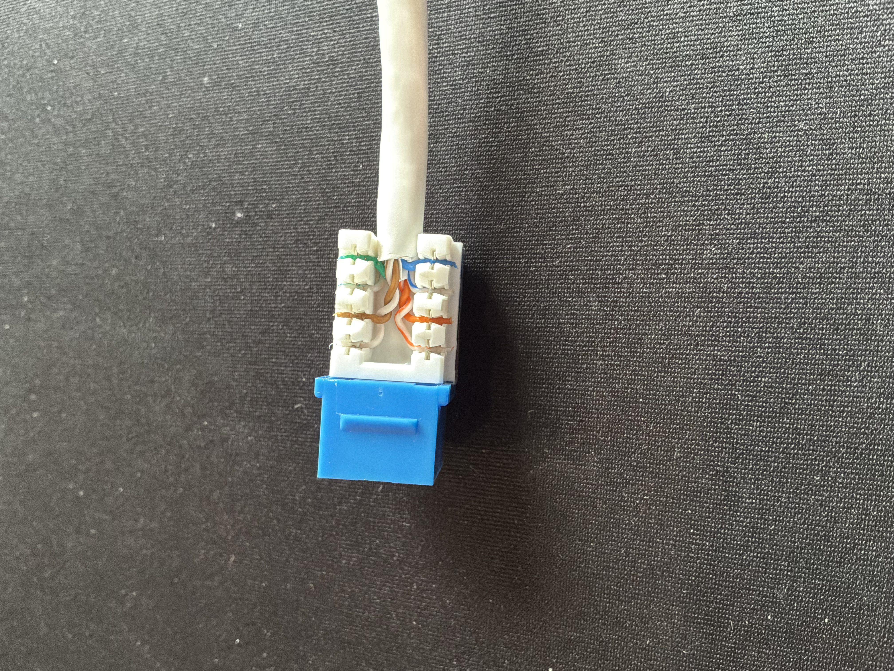
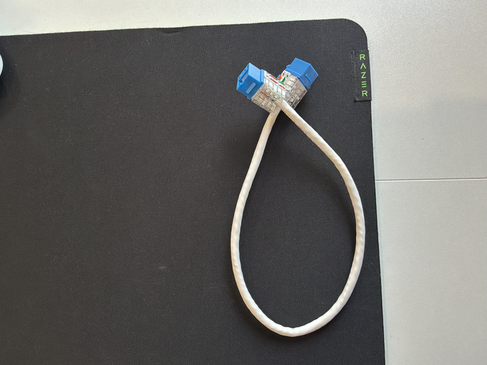
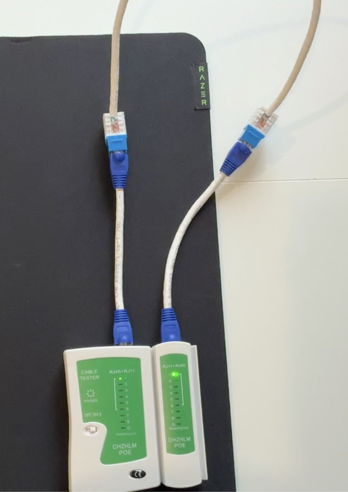

# Keystone Jack Termination

## Overview

For this project, I practiced terminating Cat6 Ethernet cable into keystone jacks using a 110 punchdown tool. The goal was to learn how to prepare the cable, follow the keystone jack's T568B color-coded wiring guide, properly seat the conductors into the IDC terminals, and verify the completed connection using an Ethernet cable tester.

## Equipment Used
  * Cat6 Ethernet cable
  * Cat6 keystone jacks
  * 110 punchdown tool
  * Cable stripper/cutter
  * Ethernet cable tester

## Cable Termination Process

### 1. Preparing the Cable

I began by removing a portion of the Cat6 cable's outer jacket to expose the four twisted pairs. I then trimmed the spline and ripcord so that the conductors could be positioned into the keystone jack.
Unlike an RJ45 connector termination, the conductors do not need to be straightened and arranged into a single eight-wire sequence. Instead, each twisted pair is routed to the appropriate IDC terminals on the keystone jack according to its color-coded wiring guide.
I kept the pairs twisted as close to the IDC terminals as possible to minimize unnecessary untwisting and help maintain the cable's resistance to crosstalk and interference.

  

<em>Cat6 cable prepared for keystone jack termination</em>

### 2. Following the Keystone Jack Wiring Guide

The keystone jack includes a color-coded wiring guide for both the T568A and T568B standards. For this project, I followed the T568B markings to remain consistent with the wiring standard that I used for my previous Ethernet cabling project.
Instead of arranging all eight conductors into a single sequence as I did when terminating an RJ45 connector, I matched each conductor to the corresponding color-coded IDC terminal on the keystone jack.
After identifying the T568B color-coded wiring guide, I separated the four twisted pairs only as much as necessary and routed each conductor to its corresponding IDC terminal on the keystone jack. I made sure the cable jacket remained close to the termination point and preserved the twists in each pair as close to the IDC terminals as possible to help reduce crosstalk and interference.
I made sure to follow the T568B row of the wiring diagram and double-checked the conductor placement before punching them down.

  

<em>Conductors positioned in the appropriate IDC terminals according to the T568B wiring guide</em>

### 3. Punching Down Conductors 

Once the conductors were positioned correctly, I used a 110 punchdown tool to seat each conductor into the keystone jack's IDC terminals.
I positioned the **CUT** side of the punchdown blade toward the excess end of the conductor. When the tool was pressed down, the conductor was pushed securely into the IDC terminal while the excess wire extending beyond the terminal was trimmed.
The IDC terminals make contact with the conductor by cutting through its insulation and establishing an electrical connection with the copper conductor inside.
I repeated the process for all eight conductors and inspected each termination to make sure the wires were fully seated and the excess conductor ends had been trimmed properly.

  

<em>Using a 110 punchdown tool to seat and trim the conductors in the Keystone jack.</em>

### 4. Inspecting and Securing the Termination
After punching down all eight conductors, I visually inspected the termination to make sure each conductor was fully seated in its IDC terminal and that the excess wire had been properly trimmed.
I also checked that the conductors matched the T568B color-coded wiring guide and that the twisted pairs remained as close to the IDC terminals as possible.

  

<em>Results of a punchdown termination.</em>

Once I verified the termination, I installed the protective cap over the IDC terminals. The cap helps protect the terminated conductors and keeps them secured inside the keystone jack.

  

<em>Added protective cap</em>

I repeated the same termination process on the opposite end of the Cat6 cable using another keystone jack and following the T568B wiring standard.

  

<em>Cat6 cable terminated with keystone jacks on both ends</em>

### Keystone Jack Termination Demonstration

The video below shows the process I followed to position and punch down the conductors into a keystone jack.

**Preparing Cat6 Cable**

https://github.com/user-attachments/assets/4e70b178-0149-4241-a740-ef404419e809

**Arranging the Conductors**

https://github.com/user-attachments/assets/09285a2d-6f31-42d0-86af-4b5d17d51f28

**Punching Down the Conductors**

https://github.com/user-attachments/assets/fc482ca9-6069-4e69-9635-c7cbfda93f93

### 5. Testing the Connection

After terminating the keystone jacks on both ends of the Cat6 cable, I tested the completed connection using an Ethernet cable tester.
Because the keystone jacks have female RJ45 ports, I used patch cables to connect each keystone jack to the main and remote units of the cable tester. 
The patch cables used for testing were created in my previous [Ethernet Cable Termination](../01-Ethernet-Cable-Termination/) project.

  

<em>Testing the Keystone Jack termination</em>

During the test, the indicators on the main and remote units cycled through pins 1-8 in the same order. This verified continuity and confirmed that all eight conductors were mapped to their corresponding pins through the completed keystone-to-keystone connection.

The successful test confirmed that both keystone jacks were terminated correctly and that the completed cable run had the expected straight-through wiremap.

### Cable Tester Demonstration

The video below shows the cable tester cycling through pins 1-8 after both keystone jack terminations were completed.

https://github.com/user-attachments/assets/c48a85c3-5f4c-43c8-b5f2-7f343cf5c8cf

## Troubleshooting

During this project, I encountered an issue when testing one of my keystone jack terminations. The cable tester indicated that the connection was not wired correctly, so I went back and inspected the termination instead of assuming the problem was with the tester or patch cables.

While inspecting the keystone jack, I found an issue with the placement of the blue pair associated with pins 4 and 5. I corrected the conductor placement, punched the conductors down again, and made sure they were fully seated in the correct IDC terminals.

After correcting the termination, I connected the keystone jacks back to the cable tester and performed another test. The main and remote units then cycled through pins 1-8 in the correct order, confirming that the problem had been resolved.

This troubleshooting process reinforced the importance of checking the keystone jack's wiring diagram carefully, verifying conductor placement before punching down, and always testing a completed termination. 

## Final Result

I successfully terminated Cat6 cable into two keystone jacks using the T568B wiring standard and verified the completed connection using an Ethernet cable tester.

Through this project, I gained hands-on experience with: 
 * Preparing Cat6 cable for keystone jack termination
 * Reading T568A and T568B color-coded wiring guides
 * Following the T568B wiring standard
 * Routing conductors into IDC terminals
 * Using a 110 punchdown tool
 * Correctly positioning the CUT side of the punchdown blade
 * Preserving twisted pairs near the termination point
 * Testing continuity and wiremap
 * Interpreting cable tester results
 * Troubleshooting and correcting an unsuccessful termination

## What I Learned

This project helped me understand how the same T568B wiring standard can be applied to a different type of Ethernet termination. Instead of arranging all eight conductors into a single sequence for an RJ45 connector, I learned to follow the color-coded wiring guide on a keystone jack and terminate each conductor into its corresponding IDC terminal.
I also learned the importance of proper cable preparation, preserving the twists in each pair, correctly orienting the punchdown tool, and visually inspecting each conductor after termination.
Most importantly, troubleshooting the incorrect termination gave me additional practice using a cable tester to identify a problem, inspecting my work, correcting the termination, and retesting the connection to verify that the issue had been resolved.

