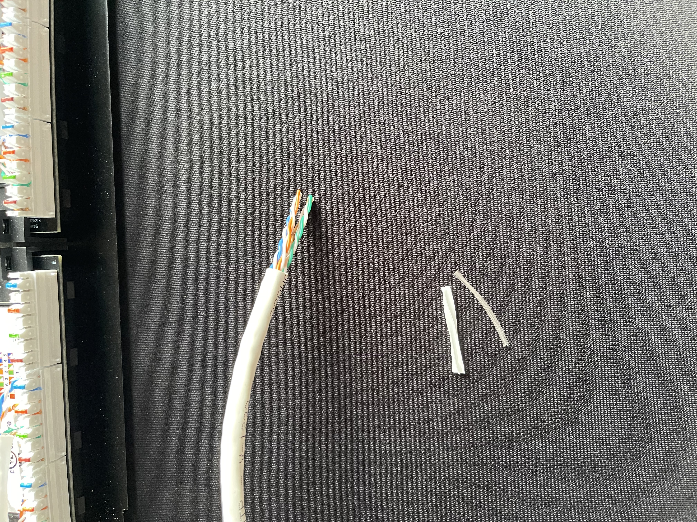
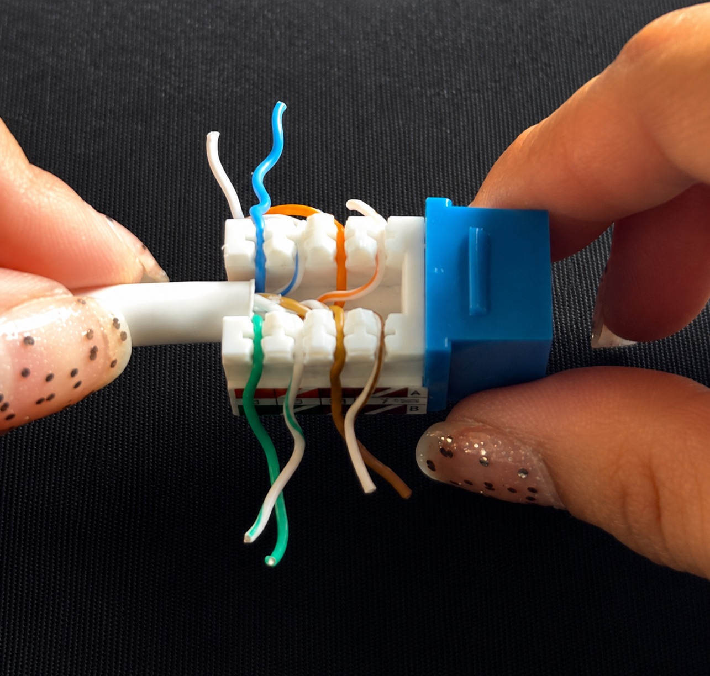
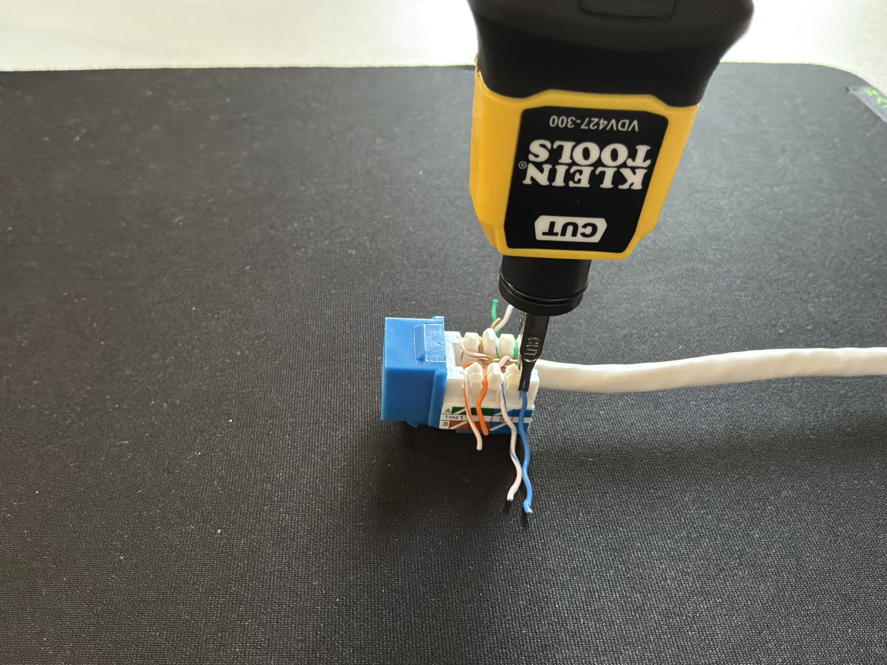

# Keystone Jack Termination

## Overview

For this project, I practiced terminating Cat6 Ethernet cable into keystone jacks using a 110 punchdown tool. The goal was to learn how to prepare the cable, follow the keystone jack's T568B color-coded wiring guide, properly seat the conductors into the IDC terminals, and verify the completed connection using an Ethernet cable tester.

## Equipment Used
  * Cat6 Ethernet cable
  * Cat6 keystone jacks
  * 110 punchdown tool
  * Cable stripper/cutter
  * Ethernet cable tester

## Cable termination Process

### 1. Preparing the Cable

I began by removing a portion of the Cat6 cable's outer jacket to expose the four twisted pairs. I then trimmed the spline and ripcord so that the conductors could be positioned into the keystone jack.
Unlike an RJ45 connector termination, the conductors do not need to be straightened and arranged into a single eight-wire sequence. Instead, each twisted pair is routed to the appropriate IDC terminals on the keystone jack according to its color-coded wiring guide.
I kept the pairs twisted as close to the IDC terminals as possible to minimize unnecessary untwisting and help maintain the cable's resistance to crosstalk and interference.

  

<em>Cat6 cable is prepared to begin the keystone jack termination</em>

### 2. Following the Keystone Jack Wiring Guide

The Keystone jack includes a color-coded wiring guide for both the T568A and T568B standards. For this project, I followed the T568B markings to remain consistent with the wiring standard that I used for my previous Ethernet cabling project.
Instead of arranging all eight conductors into a single sequence as I did when terminating an RJ45 connector, I matched each conductor to the corresponding color-coded IDC terminal on the keystone jack.
After identifying the T568B color-coded wiring guide, I separated the four twisted pairs only as much as necessary and routed each conductor to its corresponding IDC terminal on the keystone jack. I made sure the cable jacket remained close to the termination point as well as preserved the twists in each pair as close to the IDC terminals as possible to help reduce crosstalk and interference.
I made sure to follow the T568B row of the wiring diagram and double-checked the conductor placement before punching them down.

  

<em>Conductors inserted into the appropriate IDC terminal</em>

### 4. Punching Down Conductors 

Once the conductors were positioned correctly, I used a 110 punchdown tool to seat each conductor into the keystone jack's IDC terminals.
I positioned the **CUT** side of the punchdown blade toward the excess end of the conductor. When the tool was pressed down, the conductor was pushed securely into the IDC terminal while the excess wire extending beyond the terminal was trimmed.
The IDC terminals make contact with the conductor by cutting through its insulation and establishing an electrical connection with the copper conductor inside.
I repeated the process for all eight conductors and inspected each termination to make sure the wires were fully seated and the excess conductor ends had been trimmed properly.

  

<em>Punchdown tool used to seat and trim the conductors into the Keystone jack.</em>

