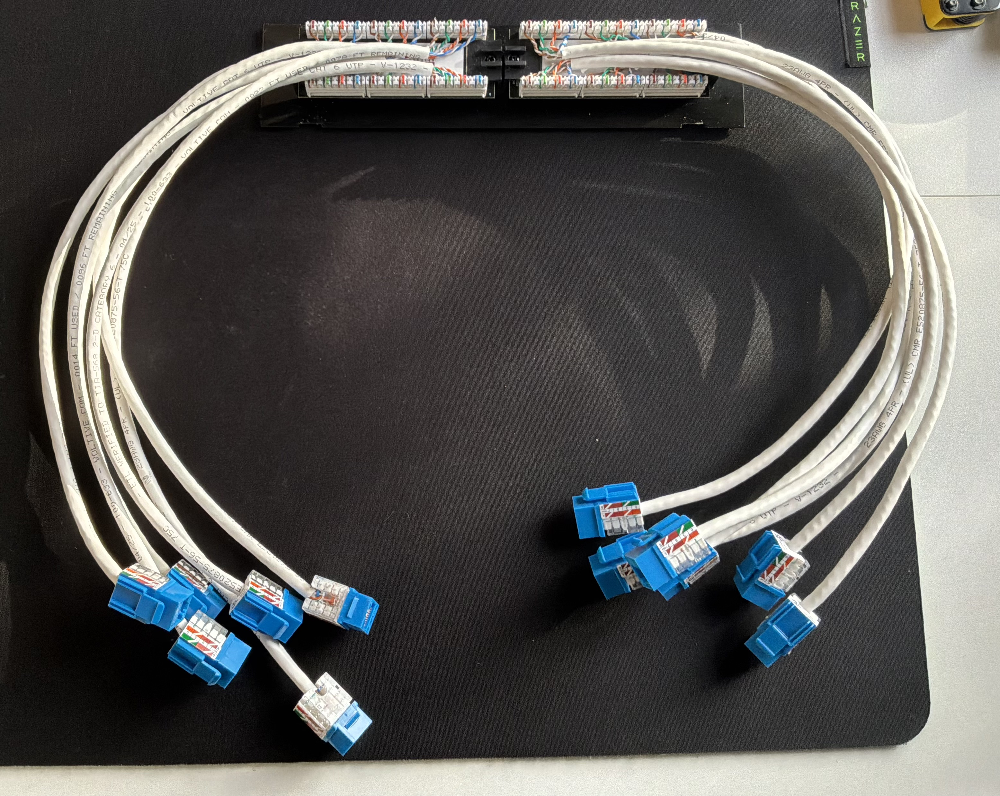

# Patch Panel Termination 

## Overview

For this project, I practiced terminating Cat6 Ethernet cable into a 12-port patch panel using a 110 punchdown tool. The goal was to learn how a patch panel is used in structured cabling, how to follow the panel's T568B wiring guide, properly terminate multiple cable runs, organize and secure the cables, and verify each completed connection using an Ethernet cable tester.
I first practiced the termination process on a single patch panel port before moving on to the remaining ports. Each Cat6 cable was terminated into the patch panel on one end and a keystone jack on the opposite end to simulate cabling runs that could be used between a central network location and wall outlets.
Because this was a lab, I cut the cable runs to shorter lengths so that they would be easier to manage. In a real installation, these cable runs can be much longer and may travel through walls and ceilings from individual rooms back to the network closet where the patch panel is located.

## Equipment Used
  * 12-port patch panel
  * Cat6 Ethernet cable
  * Cat6 keystone jacks
  * 110 punchdown tool
  * Cable stripper/crimper
  * Ethernet cable tester
  * Patch cables
  * Zip ties

## Understanding the Cable Setup

Before starting the terminations, I wanted to understand why the Cat6 cable was being terminated to a patch panel on one end and a keystone jack on the other end. In a structured cabling setup, the patch panel acts as a central location where Ethernet cable runs from different rooms can be terminated and organized. The front of the patch panel contains RJ45 ports where shorter patch cables (with RJ45 connectors on both ends) can be used to connect the cable runs to a network switch.
On the back of the patch panel, the permanent Cat6 cables are terminated into the IDC terminals, while the opposite end of each cable run is terminated into a keystone jack, which acts as the network outlet. Another patch cable can then be plugged into the keystone jack to connect a computer, printer or another network device.

The complete connection would look like this:
**Switch -> Patch Cable -> Patch panel -> Cat6 Cable Run -> Keystone Jack -> Patch Cable -> End Device**

## Patch Panel Termination Process

### 1. Preparing the Cat6 Cable

Using a cable stripper or cutter, I began by removing a portion of the Cat6 cable's outer jacket to expose the four twisted pairs. I then trimmed the spline and ripcord so that the conductors could be properly separated and positioned for termination. While removing the jacket, I made sure not to cut into or damage any of the conductors. I also kept the pairs twisted as close to the IDC slots as possible instead of untwisting and straightening the entire exposed section of the cable like I did when terminating the RJ45 connectors. Keeping the twists as close to the termination point helps reduce crosstalk and interference. 
I prepared both ends of the cable so that one end could be terminated into a keystone jack and the other into the patch panel.

https://github.com/user-attachments/assets/87eada11-2d1a-4999-bd85-176078cc6614

<em> This video shows the process of preparing a Cat6 cable for termination by removing the outer jacket and cutting off the spline and ripcord.</em>

### 2. Terminating the Keystone Jack End

I terminated one end of the Cat6 cable into a keystone jack using the T568B wiring standard. I followed the color-coded wiring guide printed on the keystone jack and positioned each conductor into its corresponding IDC terminal. I then used a 110 punchdown tool to seat and trim each conductor. I made sure the Cat6 cable was slightly inside the keystone jack and covered it with its protective cap to keep the terminated conductors covered and protected.
As mentioned before, a user could connect a patch cable from the wall outlet containing the keystone jack to their device. The permanent Cat6 cable behind the wall would then run from the keystone jack back to the patch panel.
I documented the keystone termination process in more detail in my [02-Keystone Jack Termination](../02-Keystone-Jack-Termination/) project.

https://github.com/user-attachments/assets/ef34b3eb-91c6-4d38-9f59-76779d824798

<em> This video shows the process followed to terminate a Cat6 cable into a keystone jack.</em>

### 3. Positioning the Conductors

Before terminating the patch panel end of the cable, I looked at the color-coded wiring diagram printed on the back of the patch panel. The panel included markings for both the T568A and T568B wiring standards and, like in my previous labs, I followed the T568B markings.
One thing I had to pay close attention to was the way the wiring diagram was printed on this specific patch panel. The physical position of the IDC terminals did not look like the eight-wire sequence I was already familiar with from terminating RJ45 connectors. I initially had to take some time to understand how the color markings on the panel corresponded to each conductor and where I needed to position them so that I could still follow the T568B wiring standard correctly.
Once I understood the diagram, I began routing each twisted pair toward its corresponding IDC terminals. During my first attempt, I realized that I had not removed enough of the outer jacket for some of the conductors to comfortably reach their terminals. Instead of pulling the conductors tightly across the patch panel, I removed a little more of the jacket so that I had enough length to position the pairs correctly without causing unnecessary tension.
Once I had enough working length, I routed the pairs to their corresponding terminals while keeping as much of each pair twisted as possible. I only separated the conductors where necessary and used the end of my wire stripping tool to push down the conductors into their corresponding slots before using the punchdown tool to fully seat them into the IDC terminals. After positioning all eight conductors, I was ready to punch them down.

https://github.com/user-attachments/assets/710c9833-1f4a-49fa-9151-96d73096087b

<em> This video shows the process of positioning the conductors into their corresponding IDC slots</em>

### 4. Punching Down the Conductors

Once I had the conductors in the correct positions, I used a 110 punchdown tool to seat them into the patch panel's IDC terminals. I positioned the CUT side of the punchdown blade toward the excess end of each conductor. This allowed the tool to push the conductor into the IDC terminal while cutting off the excess wire on the outside of the termination. I worked through the conductors one at a time until all eight were seated and all the excess wires had been trimmed and removed.
After completing the port, I visually inspected the termination to make sure none of the conductors were loose or sticking out of the IDC terminals and that the wiring matched the T568B diagram.

https://github.com/user-attachments/assets/a63f7e7b-20c0-4647-bddd-3e47f4b2f094

<em> This video shows the process of using a 110 punchdown tool to fully seat the conductors into the patch panel's IDC terminals and how it trimmed the excess wire.</em>

### 5. Testing Each Cable Run

After completing the termination, I tested the connection using my Ethernet cable tester.
Because the patch panel and keystone jack both have female RJ45 ports, I used patch cables to connect both ends of the cable run to the tester's main and remote units. One patch cable connected the corresponding RJ45 port on the front of the patch panel to the main tester, while another patch cable connected the keystone jack on the opposite end of the cable run to the remote tester.
The tester cycled through pins 1-8 on both the main and remote units, confirming that the conductors had continuity and that they were mapped to the correct pins throughout the completed cable run. 
I tested each port after terminating the corresponding run to avoid any confusion once all the ports were completed.

https://github.com/user-attachments/assets/aede7f08-49f0-4221-89f6-1512cba0fac9

<em> This video shows how an Ethernet cable tester is used to verify continuity and the wiremap of the completed cable run.</em>

### 6. Organizing and Securing the Cable Runs

As I worked through each port, I organized the cable runs that I terminated in a way that would prevent them from unnecessarily crossing over each other or making it difficult to tell which cable belonged to which port. I lined up the cable runs with their corresponding patch panel ports and worked through the ports in order. I divided the 12 cable runs into two groups. The cables for ports 1-6 were routed toward one side of the patch panel, and the cables for ports 7-12 were routed toward the other side. Splitting the cables between both sides helped me keep the bundles behind the patch panel more organized and made it easier for me to keep track of each individual cable run as I worked. As I completed each termination, I routed the cable runs along the cable management bar and used zip ties to keep them grouped and supported. I made sure not to pull the zip ties too tightly or put unnecessary tension on the terminated cables.
Keeping the cable runs organized is important in a larger network because a network technician may eventually need to identify, troubleshoot, or replace a specific cable run. Having proper cable management can make it easier to trace a cable back to its corresponding patch panel port and work on an individual run without having to sort through an unorganized group of cables.

 

<em>Completed rear patch panel terminations with the cable runs organized.</em>

### 7. Final Result

After completing all of the terminations, I had 12 Cat6 cable runs with one end terminated to a keystone jack and the other end terminated to the patch panel. I also connected 8 patch cables to the front of the patch panel, which will be connected to an 8-port switch in my next lab. All the cable runs were organized, secured, and tested using an Ethernet cable tester.

 

<em>Completed Cat6 cable runs with one end terminated at the patch panel and the opposite ends terminated to their corresponding keystone jacks.</em>

### 8. What I Learned

This project helped me better understand how a patch panel fits into a structured cabling system and how permanent cable runs can connect a central network location to keystone jacks located throughout a building. 
Some of the things I learned during this project were:
  - How to read and follow the T568B wiring guide on a patch panel.
  - How the layout of the IDC terminals on a patch panel can look different depending on the model/manufacturer.
  - How to position and punch down conductors into the patch panel's IDC terminals using a 110 punchdown tool.
  - Why the twisted pairs should remain twisted as close to the termination point as possible.
  - How the front and back of the patch panel work together, with permanent cable runs terminated on the back and patch cables connected to the RJ45 ports on the front.
  - How to test a complete cable run between a patch panel and keystone jack using an Ethernet cable tester.
  - How organizing and securing multiple cable runs can make it easier to identify and troubleshoot individual connections.
